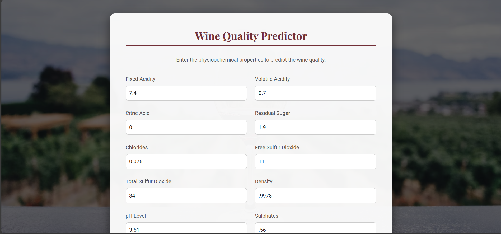
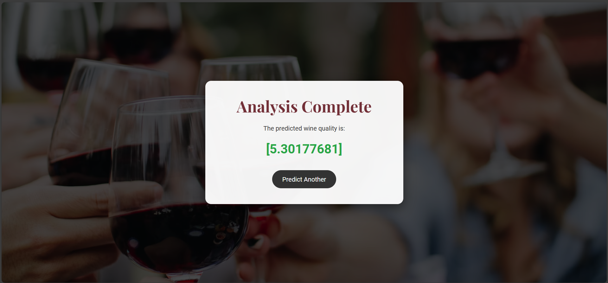

# 🍷 Wine Quality Prediction — MLOps Project

This project implements a complete **end-to-end MLOps pipeline** for predicting **Red Wine Quality** using an **ElasticNet Regression model**. The pipeline automates data ingestion, validation, preprocessing, model training, and evaluation. It also includes **MLflow integration** for experiment tracking and a **Flask web application** for real-time predictions.

---

## ⚙️ MLOps Pipeline Architecture

| Stage | Description |
|-------|------------|
| **Data Ingestion** | Downloads raw dataset from a remote source and stores it locally. |
| **Data Validation** | Validates schema (column types, column presence) using `schema.yaml`. |
| **Data Transformation** | Preprocesses data — train-test split, scaling, and feature preparation. |
| **Model Training** | Trains ElasticNet model and stores artifact as `model.joblib`. |
| **Model Evaluation** | Evaluates performance, logs metrics to `metrics.json` and MLflow. |

**📌 Dataset Source:**  
*(Wine Quality Data by Krishnaik)*  
`https://github.com/krishnaik06/datasets/raw/refs/heads/main/winequality-data.zip`

---

## 📊 Model & Dataset Details

### **🔧 Model Parameters (ElasticNet Regression)**

Defined in `params.yaml`:

| Parameter | Value |
|----------|-------|
| alpha | 0.2 |
| l1_ratio | 0.1 |

---

### **🧪 Input Feature Schema**

All features are `float64`, target column is `int64`.

| Feature | Type | Feature | Type |
|---------|------|---------|------|
| fixed acidity | float64 | free sulfur dioxide | float64 |
| volatile acidity | float64 | total sulfur dioxide | float64 |
| citric acid | float64 | density | float64 |
| residual sugar | float64 | pH | float64 |
| chlorides | float64 | sulphates | float64 |
| **Target: quality** | **int64** | alcohol | float64 |

---

## 🚀 Setup & Run

### **📍 Prerequisites**
- Python 3.x
- pip installed

---

### **1️⃣ Installation**

```bash
# Clone the repository
git clone <Your-Repository-URL>
cd wine-quality-prediction-mlops

# Install dependencies
pip install -r requirements.txt
```

### **Key Dependencies**
- `mlflow==2.22.1`
- `scikit-learn`
- `Flask`, `Flask-Cors`
- `pandas`, `numpy`

---

### **2️⃣ Run Full MLOps Pipeline**

This will run:  
**Ingestion → Validation → Transformation → Training → Evaluation**

```bash
python main.py
```

Artifacts are generated inside **`artifacts/`** and metrics are logged to **MLflow UI**.

---

### **3️⃣ Run Web Application (Flask)**

```bash
python app.py
```

### **🌐 Access Application**
Open browser:

```
http://0.0.0.0:8080
```
or
```
http://127.0.0.1:8080
```

---

## 🧭 API Routes

| Route | Method | Description |
|-------|--------|-------------|
| `/` | GET | Homepage UI for input |
| `/train` | GET | Triggers full MLOps pipeline |
| `/predict` | POST/GET | Returns wine quality prediction |

---

## 🖼️ Application Screenshot

### Input Page


### Result Page


---

## 📂 Project Structure (Suggested)

```
├── artifacts/
├── src/
│   ├── ingestion.py
│   ├── validation.py
│   ├── transformation.py
│   ├── trainer.py
│   └── evaluation.py
├── app.py
├── main.py
├── schema.yaml
├── params.yaml
├── requirements.txt
└── README.md
```

---

## ⭐ Project Highlights

- Fully modular & scalable MLOps pipeline
- MLflow experiment tracking
- Flask-based real-time predictions
- ElasticNet regression with custom config
- Automated artifact generation

---

### 💡 Future Improvements

- CI/CD deployment (GitHub Actions)
- Docker & Kubernetes integration
- Model registry with MLflow
- Streamlit UI version

---

### 📜 License

This project is open-source and available under the **MIT License**.

---

### 👨‍💻 Author

**Satyam Pant**
